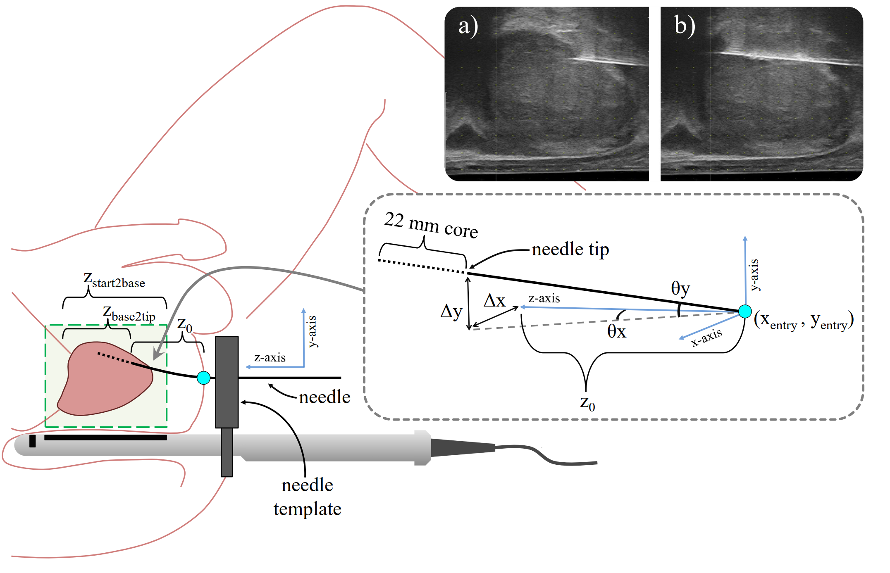

# Registration of trans-perineal template mapping biopsy cores to volumetric ultrasound (TTMB biopsy core registration)

Pathology from trans-perineal template mapping biopsy (TTMB) can be used as labels to train classifiers for prostate cancer detection. This framework allows quick registration of TTMB cores to volumetric ultrasound while taking into account presence of any needle deflection. The full work will be presented in <a href="https://sites.google.com/view/ipcai2022/home" target="_blank">IPCAI 2022</a> in Tokyo, Japan.  

<!-- <a href="" target="_blank">Paper |</a>
<a href="" target="_blank" rel="noopener noreferrer">Presentation</a>
 -->
 
<p align="left">
<a href="#"></a>
</p>

### Dependencies
```
MATLAB 2021a 
```

### Training

To run the code, use `main.m` file. Due to privacy policy, we are unable to share our full dataset. However, we have included anonymized version of a case for reference. Format your dataset in the same way and modify the `path_report_sample.xlsx` file accordinly. This excel file needs to be populated with the input informations as explained in the manucript.

### Citation

Please cite the following paper if you use this code in your work:
```
@article{aleef2021,
title={Registration of trans-perineal template mapping biopsy cores to volumetric ultrasound},
author={Aleef, Tajwar Abrar, Zeng, Qi, Morris, W. James, Mahdavi, S. Sara, and Salcudean, Septimiu E.},
booktitle="International Conference on Information Processing in Computer- Assisted Interventions -- IPCAI 2022",
year={2022},
organization={Springer}
}
```

### Contact 

If you face any problem using this code then please create an issue in this repository or contact me at [tajwaraleef@ece.ubc.ca](mailto:tajwaraleef@ece.ubc.ca?subject=[GitHub]%20TTMB-registration%20Issue%20)

### Acknowledgements

The <a href="https://www.mathworks.com/matlabcentral/fileexchange/41334-imshow3d?s_tid=prof_contriblnk" target="_blank">imshow3D.m</a> file is taken from Maysam Shahedi.

### License
MIT

